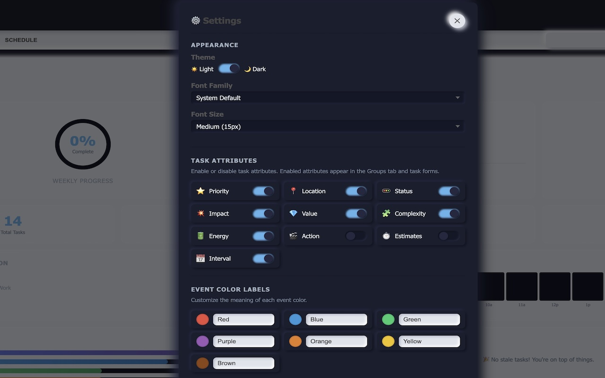
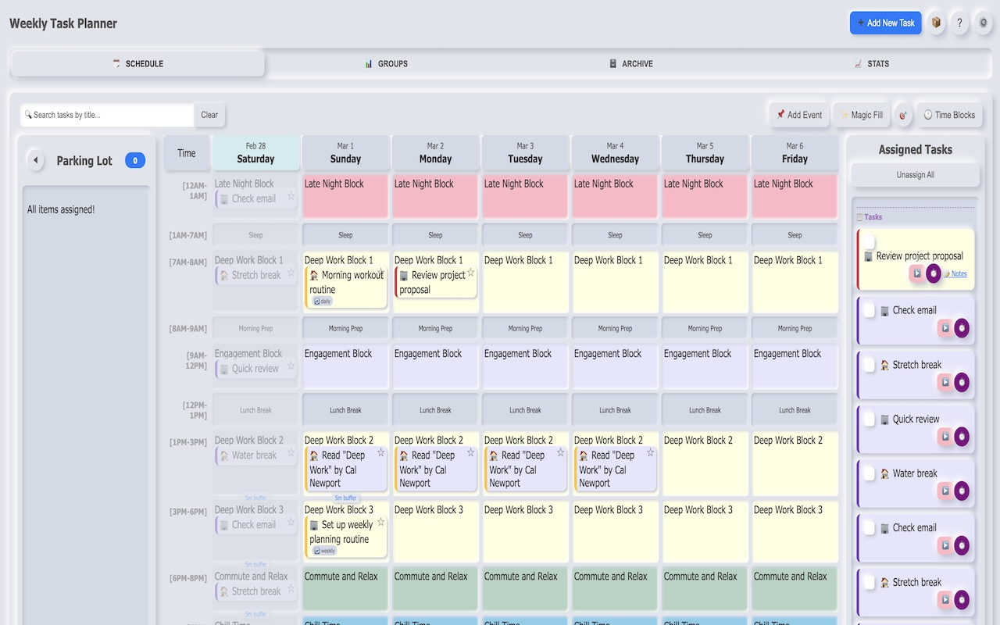
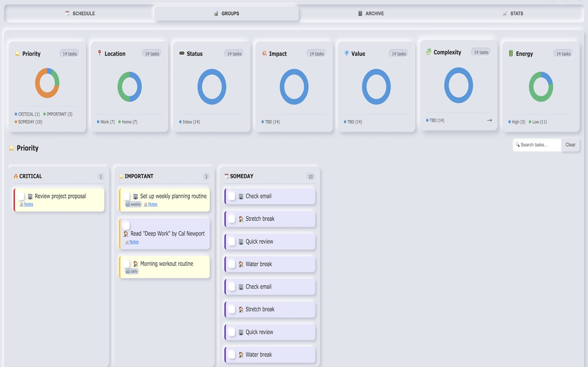
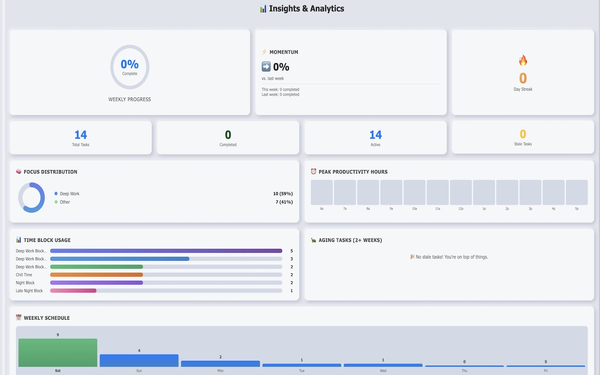
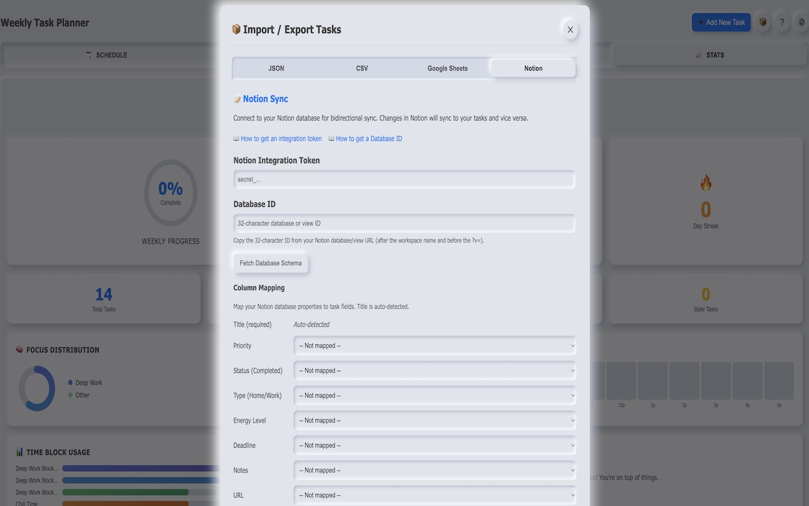

# Weekly Task Manager

## Chrome Extension
[Chrome Web Store Install](https://tinyurl.com/tasks-planner)

**Version 2.3.0**

A Chrome/Chromium browser extension for managing weekly tasks with priority levels, categories, energy tracking, 10 toggleable task attributes, Event Notes with auto-expiry and recurrence, a Most Important Thing (MIT) daily star system, and a visual weekly planner grid. Schedule tasks and events into time blocks, track completion and MIT streaks across the week, and keep everything in sync between the popup and full-page planner. Features a polished dark mode with comprehensive contrast fixes for all UI components.

## Features

### Task Management

- **Three Priority Levels:** Critical (requires a deadline), Important, and Someday
- **Categories:** Classify tasks as Home or Work
- **Energy Levels:** Tag tasks as Low or High energy for better daily planning
- **Deadlines:** Required for Critical tasks, with days-remaining/overdue display
- **URL Attachments:** Optionally link a URL to any task (opens in new tab)
- **Task Notes:** Add detailed notes/descriptions to any task; collapsible in all views
- **Recurring Tasks:** Mark tasks as Daily, Weekly, or Monthly — a new instance is automatically created when the task is completed
- **Cascade Completion:** When all scheduled assignments for a task are completed, the parent task is automatically marked complete
- **Last Modified Tracking:** Every task has a `lastModified` timestamp that updates automatically on any change
- **Auto-Save:** Inline edits in the planner auto-save after 1.5 seconds; task edit modal auto-saves after 800ms with visual "Saving.../Saved ✓" indicator
- **Event Notes:** Lightweight event/appointment entries (e.g., "Go to Shopping", "Visit friend") — visually distinct from tasks with dashed purple borders, no completion tracking, auto-expire when assigned time block passes, support for recurring (daily/weekly/monthly) with automatic next-instance creation
- **MIT Star System:** Mark one task or event per day as your Most Important Thing (MIT) with a star. Track MIT completion streaks and 30-day completion rate in Stats. Past unresolved MITs prompt a follow-up modal on next planner visit.
- **Cross-Tab Sync:** Changes in the popup are reflected in the planner page in real-time, and vice versa (tasks, events, and MIT history)
- **Import/Export:** Back up tasks to JSON or CSV (timestamped files), or import from JSON with smart merge logic (matching IDs update, new IDs create)
- **Notion Import:** Import tasks from a Notion database with full attribute mapping support (priority, type, energy, impact, value, complexity, action, estimates, interval)
- **Google Sheets Import:** Import tasks from a published Google Sheets CSV (via Settings)
- **10 Toggleable Task Attributes:** Configure which attributes to show/hide: Priority, Type, Status, Impact, Value, Complexity, Energy, Action, Estimates, Interval
- **Groups Tab:** Bento grid view showing tasks grouped by any enabled attribute with mini donut charts; click to drill down with completed tasks disclosure toggle
- **Task Details Modal:** Double-click any task to view full details with colorful attribute tags
- **Race Condition Protection:** An operation queue serializes rapid concurrent operations (e.g., fast checkbox clicks)
- **Undo/Redo:** Ctrl+Z / Ctrl+Shift+Z undo/redo support (up to 5 history entries); undo toast appears after destructive actions
- **Sample Tasks:** On first run, 6 sample tasks are automatically created to demonstrate all features

### Popup Interface

The popup (500px wide) provides quick access through three tabs:

- **TODAY Tab** — Shows tasks scheduled for the current day, grouped by time block and sorted chronologically. Each scheduled assignment has its own checkbox for individual completion.
- **Display Tab** — Lists all active (non-completed) tasks sorted by priority, then by custom display order. Supports drag-and-drop reordering within the same priority group. The master checkbox completes a task and all its scheduled assignments at once.
- **ADD Tab** — A form for creating new tasks with title, optional URL, priority (with conditional deadline for Critical), type (Home/Work), energy level (Low/High), optional notes, and optional recurrence (Daily/Weekly/Monthly).

### Planner Page (Full-Page Manager)

Access the planner by clicking the "PLANNER" button in the popup. It opens in a new tab with five views and a header containing:
- **➕ Add New Task** button — Opens a modal to create new tasks (available from any tab)
- **Help (?)** and **Settings (⚙️)** buttons with hover tooltips


- **SCHEDULE Tab** — A three-column layout:
  - *Parking Lot* sidebar listing unscheduled tasks and events (events shown with purple separator)
  - *Weekly Grid* with 7 rotating days (starting from today) and configurable time blocks for drag-and-drop scheduling
  - *Assigned Tasks* sidebar with an "Unassign All" button
  - Today's column is visually highlighted. Time block slot limits are enforced during drag-and-drop.
  - **Add Event** button creates event notes that appear in the Parking Lot
  - **MIT Stars** on grid items: click to mark as your Most Important Thing for that day (exactly 1 per day)
  

- **GROUPS Tab** — Bento grid view of tasks grouped by enabled attributes:
  - Each attribute box shows active task count and mini donut chart showing distribution
  - Click any box to drill down into that attribute's groupings
  - Drill-down view with horizontal columns for each attribute value
  - Completed tasks disclosure toggle in each column (collapsed by default)
  - Double-click any task to open Task Details modal
  - Search bar filters tasks within drill-down view
  

- **ARCHIVE Tab** — Completed tasks grouped by completion date, sorted by last modified (most recent first) within each group. Features a wider search bar and individual restore buttons; a "Clear All Completed" button removes all completed tasks (with undo support).

- **STATS Tab** — Visual HTML/CSS charts showing task completion rate, priority distribution, energy distribution, tasks per day, event stats (total, scheduled today, day distribution), and MIT stats (streak, 30-day completion rate, weekly status).


### Settings Modal

Click the ⚙️ button (top-right in the planner) to open Settings:

- **Appearance** — Toggle Dark/Light mode (with comprehensive contrast fixes for all UI components), choose font family and font size
- **Notion Import** — Connect your Notion workspace and import tasks from a database
- **Google Sheets Import** — Import tasks from a published Google Sheets CSV URL

### Import/Export Modal

Access via the "Import/Export" button in the SCHEDULE tab header:

- **Export JSON** — Download all tasks as a timestamped JSON file
- **Export CSV** — Download all tasks as a timestamped CSV file for spreadsheet use
- **Import JSON** — Upload a JSON file to merge with existing tasks


### Time Blocks Modal

Access via the "Time Blocks" button in the SCHEDULE tab header:

- **View all time blocks** — See the full list with labels, times, limits, and colors
- **Inline label editing** — Click any block label to rename it directly in the table
- **Add new blocks** — Create custom time blocks with overlap validation
- **Delete blocks** — Remove unwanted time blocks
- **Reset to defaults** — Restore the original 11 time blocks

### Help Modal

Click the ? button to open the interactive Help guide with 8 sections: Overview, Quick Start, Schedule, Priority, Location, Settings, Import/Export, and FAQ. Includes documentation for Event Notes and MIT Star System.

### Time Blocks

The weekly planner grid uses 11 configurable time blocks:

| Time | Block | Slot Limit |
|------|-------|------------|
| 12AM-1AM | Late Night Read | Multiple |
| 1AM-7AM | Sleep | 0 (blocked) |
| 7AM-8AM | AI Study Time | 1 |
| 8AM-9AM | Morning Prep | 0 (blocked) |
| 9AM-12PM | Engagement Block | Multiple |
| 12PM-1PM | Lunch Break | 0 (blocked) |
| 1PM-3PM | Deep Work Block 1 | 1 |
| 3PM-6PM | Deep Work Block 2 | 1 |
| 6PM-8PM | Commute and Relax | Multiple |
| 8PM-10PM | Family Time Block | Multiple |
| 10PM-11PM | Night Build Block | 1 |

## Installation

Load the extension as an unpacked package in any Chromium-based browser:

1. **Download or Clone** this repository to a local folder.
2. **Open the Extensions Page:**
   - Chrome: `chrome://extensions`
   - Edge: `edge://extensions`
3. **Enable Developer Mode** using the toggle in the top-right corner.
4. **Click "Load unpacked"** and select the folder containing `manifest.json`.
5. The extension icon appears in your toolbar.

## Usage

1. **Adding a Task:** Click the extension icon and use the ADD tab, OR click "PLANNER" and use the **➕ Add New Task** button in the header (accessible from any tab) to open the add task modal.
2. **Scheduling a Task:** Click "PLANNER" to open the full manager. On the SCHEDULE tab, drag tasks from the Unassigned list onto time block cells in the weekly grid.
3. **Completing Tasks:**
   - In the popup TODAY tab, check off individual scheduled assignments.
   - In the popup Display tab, use the master checkbox to complete a task and all its assignments.
   - In the planner PRIORITY tab, expand a task's schedule to complete individual assignments.
4. **Editing a Task:** In the planner PRIORITY tab, click "Edit" on any task. Changes auto-save after 1.5 seconds, or click "Save" to save immediately.
5. **Reordering:** Drag-and-drop in the popup Display tab (within same priority) or use arrow buttons in the planner PRIORITY tab.
6. **Settings:** Click ⚙️ in the planner to open Settings — toggle Dark Mode, change fonts, or configure Notion/Google Sheets import.
7. **Export/Import:** Click "Import/Export" in the SCHEDULE tab header to export tasks (JSON or CSV) or import from JSON.
8. **Time Blocks:** Click "Time Blocks" in the SCHEDULE tab header to view, edit labels inline, add, delete, or reset time blocks.
9. **Undo:** Press Ctrl+Z (or Cmd+Z on Mac) in the planner to undo the last destructive action. A toast notification appears after deletions with a clickable "Undo" link.
10. **Archive:** View completed tasks in the ARCHIVE tab, grouped by date. Click "Restore" to move a task back to active.

## Development

### Loading the Extension

No build process is required. Load directly as an unpacked extension (see Installation). After code changes, click the refresh icon on the extension card in `chrome://extensions`.

### Running Tests

All test infrastructure is located in the `tests/` folder:

```bash
# Navigate to tests folder
cd tests

# Install dependencies (first time only)
npm install

# Run all tests
npm test

# Run tests in watch mode
npm run test:watch

# Run tests with coverage report
npm run test:coverage
```

The test suite includes **573+ tests** across 10 test files:

| Test Suite | Tests | Coverage |
|-----------|-------|----------|
| `task_utils.test.js` | ~104 | Task class (10 attribute fields), CRUD, settings, time blocks, undo/redo, recurring tasks, time validation, debounce, sync, status-completion sync |
| `popup.test.js` | ~17 | Task item rendering, tab switching, completion handlers, drag-and-drop |
| `manager.test.js` | ~122 | Grid generation, Groups tab, archive tab, stats, search filter, add task modal, context menu, focus mode, time tracking |
| `integration.test.js` | ~18 | Task lifecycle, scheduling, cascade completion, ordering, import/merge, recurring tasks, undo/redo |
| `settings.test.js` | ~84 | applySettings, initSettings, modal open/close, form population, time block editing, Notion import, enabled attributes, dark mode CSS variables |
| `features.test.js` | ~35 | Notes field, completedAt, lastModified, undo/redo stacks, recurring task creation, archive grouping |
| `search.test.js` | ~17 | applySearchFilter logic, schedule/archive/groups search |
| `schedule-features.test.js` | ~91 | Context menu, magic fill, buffer zones, focus mode, fluid resizing, time tracking, task details modal |
| `events.test.js` | ~40 | EventNote class, CRUD, backfill, duplicate, recurrence, expiry, cleanupExpiredEvents, withEventLock |
| `mit.test.js` | ~29 | MIT CRUD, 1-per-day enforcement, resolution, streak calculation, completion rate, weekly status |

### Debugging

- Right-click the extension icon and select "Inspect popup" for popup DevTools
- Open the planner page and use regular DevTools (F12) for manager debugging
- Check `chrome://extensions/` for extension error details

## Project Structure

```
todo_this_week/
  manifest.json          # Chrome Extension Manifest V3 config (v2.3.0)
  popup.html             # Popup interface markup (TODAY, Display, ADD tabs)
  popup.js               # Popup logic (rendering, tabs, completion, drag-and-drop)
  popup.css              # Unified styles (popup + manager): neumorphic + dark mode
  manager.html           # Full-page planner (SCHEDULE, GROUPS, ARCHIVE, STATS + modals)
  manager.js             # Planner logic (grid, events, MIT stars, scheduling, archive, stats)
  task_utils.js          # Shared utilities (Task class, storage, settings, undo/redo, recurring)
  settings.js            # Settings management: theme/font, Notion import, Sheets import, time blocks
  events.js              # Event Notes module (EventNote class, CRUD, expiry, recurrence)
  mit.js                 # MIT Star System module (CRUD, resolution, stats calculations)
  images/                # Extension icons (16px, 48px, 128px)
  tests/
    package.json               # Test dependencies (Jest)
    jest.config.js             # Jest configuration
    mocks/
      chrome.storage.mock.js   # Chrome API mocks + loadScript + seedSettings/seedTimeBlocks/seedEvents/seedMitHistory
    task_utils.test.js         # Unit tests for task_utils.js
    popup.test.js              # Unit tests for popup.js
    manager.test.js            # Unit tests for manager.js
    integration.test.js        # End-to-end integration tests
    settings.test.js           # Unit tests for settings.js
    features.test.js           # Tests for notes, completedAt, undo/redo, recurring tasks
    search.test.js             # Tests for search/filter functionality
    schedule-features.test.js  # Tests for schedule tab features
    events.test.js             # Unit tests for events.js
    mit.test.js                # Unit tests for mit.js
```

## Tech Stack

- **Chrome Extension Manifest V3** — Extension platform
- **Chrome Storage API** (`chrome.storage.local`) — Local data persistence
- **CSS Custom Properties** — Themeable neumorphic design system
- **Jest 29 + jsdom** — Test framework with DOM simulation
- **No build process** — Load directly as unpacked extension
- **No external runtime dependencies** — Pure vanilla JavaScript

## Version History

| Version | Date | Changes |
|---------|------|---------|
| 2.3.0 | 2026-02-28 | Dark mode comprehensive contrast fixes for all UI components (typography, tabs, buttons, forms, task items, planner grid, sidebars, modals, auto-save indicators), improved block colors for dark theme, print schedule feature, 573+ tests |
| 2.2.0 | 2026-02-26 | Event Notes with auto-expiry and recurrence, MIT (Most Important Thing) daily star system with streak tracking and follow-up modal, event and MIT stats in Stats tab, cross-tab sync for events and MIT history, 541+ tests |
| 2.1.0 | 2026-02-23 | Status-completion synchronization (completed derived from status), code optimizations (extracted helper functions), 472 tests |
| 2.0.0 | 2026-02-22 | Removed Projects, Sprint, and Why attributes (10 attributes total), added completed tasks disclosure toggle in Groups tab drill-down, Energy attribute simplified to Low/High |
| 1.9.0 | 2026-02-22 | Auto-save for task edit modal (800ms debounce), Notion import with full 13-attribute support, Groups tab immediate update after edit, 425+ tests |
| 1.8.0 | 2026-02-21 | Groups tab with bento grid, Task Details modal, 13 toggleable attributes, double-click task interaction |
| 1.5.0 | 2026-02-20 | Schedule enhancements: context menu, magic fill, buffer zones, focus mode, fluid resizing, time tracking, color coding |
| 1.4.0 | 2026-02-20 | Parking lot sidebar, drag guide lines, hover popover, current time indicator |
| 1.3.0 | 2026-02-19 | Added lastModified timestamp tracking for all tasks, archive tab sorting by last modified (most recent first), wider archive search bar, Notion integration with column/value mapping, 280+ tests |
| 1.2.0 | 2026-02-18 | Dedicated import/export modal (JSON + CSV export), dedicated time blocks modal with inline label editing and overlap validation, schedule tab header styling, help modal FAQ section, 245 tests |
| 1.1.0 | 2026-02-17 | Settings modal (dark mode, fonts), Notion + Google Sheets import, task notes, recurring tasks, undo/redo, archive tab, stats tab, search/filter, help modal, global add task button |
| 1.0.0 | 2025-08-16 | Test suite with 114 tests (Jest + jsdom), comprehensive documentation |
| 0.9.0 | 2025-08-16 | Complete tasks from Unassigned/Assigned sidebars, date headers in MONTH DAY format |
| 0.8.0 | 2025-08-14 | Week starts on Sunday, scheduler drag-and-drop overhaul, checkbox UI fixes |
| 0.7.0 | 2025-08-14 | Modern form UI, auto-save with status indicator, Edit tab removal from popup |
| 0.6.0 | 2025-08-14 | Import/export tasks, current day highlighting, energy attribute for tasks |
| 0.5.0 | 2025-08-14 | Schedule toggle, completed tasks on grid, Location tab, inline scheduling UI |
| 0.4.0 | 2025-08-13 | Weekly planner with 3-column grid layout, drag-and-drop scheduling |
| 0.3.0 | 2025-08-13 | Weekly task planner view, full browser width support |
| 0.2.0 | 2025-06-16 | Manager page with priority columns, task reordering, task type icons |
| 0.1.0 | 2025-06-15 | Initial release: core task management, popup interface, drag-and-drop reordering, deadline display, custom info messages |

## Contributing

Contributions, issues, and feature requests are welcome!

1. Fork the Project
2. Create your Feature Branch (`git checkout -b feature/AmazingFeature`)
3. Commit your Changes (`git commit -m 'Add some AmazingFeature'`)
4. Push to the Branch (`git push origin feature/AmazingFeature`)
5. Open a Pull Request

## License

This project is licensed under the MIT License. See the [LICENSE](LICENSE) file for details.
